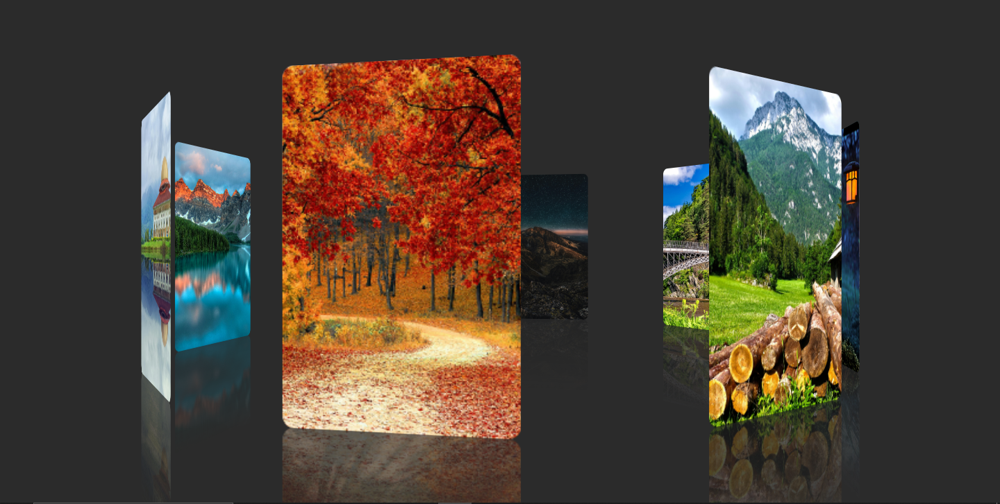

# 🌌 3D Rotating Image Gallery & Carousel Animation

A visually stunning, fully responsive 3D rotating image gallery built entirely with **Pure HTML and CSS** (No JavaScript required). This project demonstrates advanced CSS 3D transforms, perspective, and keyframe animations to create a continuous, smooth rotating carousel with an elegant floor reflection effect.

## Picture Of 3D Rotating Image Gallery & Carousel Animation



---

## ✨ Features
* **Pure CSS 3D Animation:** Utilizes `transform-style: preserve-3d` and `@keyframes` for smooth, infinite rotation.
* **Dynamic Positioning:** Images are mathematically placed in a 3D space using CSS custom variables (`--i`) and `rotateY`.
* **Glass Floor Reflection:** Uses `-webkit-box-reflect` to create a highly realistic, fading reflection beneath the images.
* **No JavaScript Needed:** High performance and lightweight, running completely on the browser's CSS engine.
* **Clean UI:** Centered layout with a sleek dark background that makes the images pop.

## 🛠️ Technologies Used
* **HTML5:** Semantic structure and custom data attributes.
* **CSS3:** Flexbox, 3D Transforms, Transitions, Keyframes, Custom Properties (Variables).

## 📁 Folder Structure
```text
📦 3D-Image-Gallery
 ┣ 📂 Images               # Contains all gallery images (Image (1).jpg, etc.)
 ┣ 📜 index.html           # Main HTML structure
 ┣ 📜 STYLES.CSS           # Core styling and 3D animations
 ┗ 📜 README.md            # Project documentation
## 💻 How to Run Locally
```
**1. Clone the repository:**
```bash
git clone https://github.com/PERVEZ-ALAM1234567/3D-Rotating-Image-Gallery.git


** Feel free to contribute, suggest new features, or report any issues by creating an issue or a pull request.
***
## 👑 Author 

## 🧑‍💻Name - **PERVEZ ALAM**  
📂 GitHub - [https://github.com/PERVEZ-ALAM1234567](https://github.com/PERVEZ-ALAM1234567)  
✉️ E-mail - pervezalam1234567@gmail.com  
🔗 LinkedIn - [http://www.linkedin.com/in/pervez-alam1](http://www.linkedin.com/in/pervez-alam1)
